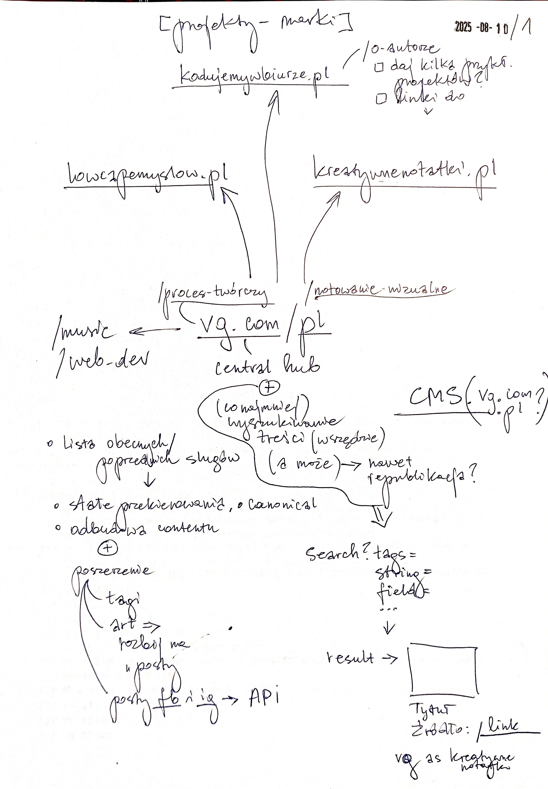

# TODO: Future improvements & additions

## Nowe wytyczne (2025-08-11)

Ten projekt nie będzie już wyłącznie generatorem i CMS mojej strony vadimgierko.com, tylko zapoczątkuje i wyłonią się z niego 2 osobne projekty:

1. samodzielny **headless git-based CMS with API routes** do zarządzania kontentem wszystkich moich (nowych-starych/ odbudowanych) stron, które zostaną wymienione w kolejnym punkcie, który może zostać postawiony na Vercelu (w tym przypadku zarządzanie kontentem będzie miało miejsce w edytorze kodu w dev mode) lub na własnym shared hosting lub VPS,
2. działający, gotowy do forkowania i deployu szablon strony internetowej, pobierający dane z powyższego CMS za pośrednictwem API, który zostanie wykorzystany do postawienia stron
   - lowcapomyslow.pl
   - kreatywnenotatki.pl
   - vadimgierko.pl
   - jakiejkolwiek innej mojej strony, opartej na kontencie.

 Aczkolwiek, żeby doszło do powyższego, najpierw
 - dopracuję obecną stronę, wszystkie jej komponenty, rozdzielając całkowicie warstwę danych od UI, co pozwoli później "wyciągnąć" ten kod jako osobny szablon strony
 - wbuduję CMS do obecnej strony (żeby wykorzystać już "ciągnące się" za tym repo pliki contentu), udostępnię API, przekształcę stronę, by pobierała dane z tego CMS, a wtedy będę mógł wyodrębnić ten projekt jako osobny CMS do forkowania przeze mnie i innych użytkowników.

 Wstępne szczegóły znajdują się w poniższych notatkach:

 

 

🚀 TODO: wypisz pomysły/zadania z powyższych notatek w postaci checklisty i realizuj krok po kroku, aż zostaną spełnione [powyższe przesłanki](#nowe-wytyczne-2025-08-11)

---

## Ad. 1. Git-based CMS & Content Types TODO

1. The ultimate goal is to shift managing content (and website data overall)
   - from dev-oriented (by hardcoding & literally typing content in the code)
   - to user-oriented (even if the user is the dev) (managing content via forms in dev mode (for now!) or in production, if the CMS will be deployed as Node.js app on hosting server or VPS).
2. The content still will be stored locally, but
   - instead of `.ts` files containing js objects managed by hand
   - => `.json` (for metadata, db-like structures etc.) & `.md` (for rich-text & large content) files managed automatically in response to user actions performed via form.
   - \+ ❗❗❗ REMEMBER TO ALSO ENABLE MANAGING IMAGES, OTHER FILES & EMBEDED MEDIA (OR EVEN LOCALLY SAVED FILES)❗❗❗
   - \+ ❗❗❗ REMEMBER TO NOT RELY ON `FieldName` (&`ItemsType`), because they will be custom names made by user❗❗❗
3. After building
   - `inside-app` CMS
   - build a `standalone` CMS
     - `for myself` at the beginning (as a central hub for all of my static websites, which will be switched to consume content via `API`,
     - then build a standarized/abstract version of the app, which could be forked on gh `for other users`

- enable adding website & all it's metadata
- enable adding tags to all content
  - collect tags as separate collection shared for all content & websites
- add created/updatedAt timestamp for all
- use special repo vadimgierko for content in /web-development & fetch all dev data from gh, choosing only what projects to show
- field => category with name given by the user => remove type FieldName & do not use that in logic

## Ad. 2. WWW Template App TODO

- ADD Search/ Filter features
  - add search box in
    - navbar
    - /[items] page
  - add search page for search results
    - /search?category= itemtype= ?? tags= ??
- IMRPOVE Print layout
  - hide bootstrap layouts (cols, cards) or manage that with css
  - manage big images
- ADD _Services_ (What can I do for you) section to each field of interest page
- ADD /[items] page for all articles, projects, videos, audios etc.
  - enable search/ filter features for each particular /[items] page
- UPDATE SEO
  - [ ] check & update metadata
    - see [TODO](/TODO.md#seo)
    - canonical where needed
  - [ ] expand metadata & open graph
  - [ ] add og metadata also to /\[items\] page
  - [ ] check how many chars title & descritpion should have & fix it
  - [ ] add conditional dynamic og:type property (article, book, website, etc. => find more)
  - [ ] add keywords prop
  - [ ] add [robots.txt](https://nextjs.org/learn/seo/crawling-and-indexing/robots-txt)
  - [ ] add [sitemap](https://nextjs.org/learn/seo/crawling-and-indexing/xml-sitemaps)
  - [ ] add html lang
  - [ ] do [further reading how to improve SEO](https://nextjs.org/learn/seo/improve)
